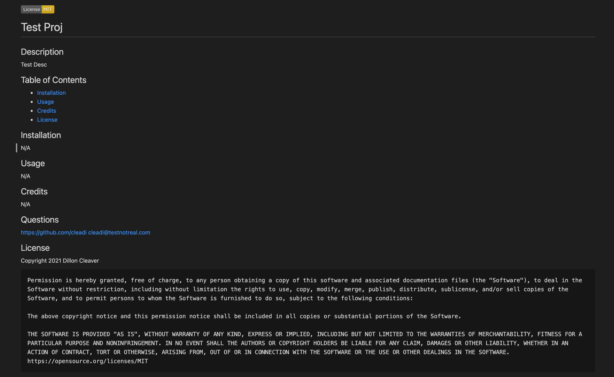

# Boot Camp HW # 7

## Project Description
- User can create a high-quailty README.md file by answering some prompts wihtin this Node.js application.
- The prompts cover all a typical README file would need to include: project title, project description, table of contents, installation instructions, usage instructions, credits -- who contributed to the project, and which -- if any -- license you've selected for your project. Note: Only three common licenses provided by this README generator.
- To use this application, you will need to clone this application to your local machine and run **node index.js** in a terminal window that's pointed to the root folder.
- Once all the questions have been answered, the application will generate a README.md file, with the file same *sample-README.md* -- which you can change on your local machine.

## Application Walkthrough Video
https://watch.screencastify.com/v/3PpTObQuVOIqj7jHVxUo

## Screenshot

## Website link
https://github.com/cleadi/good-readme-generator